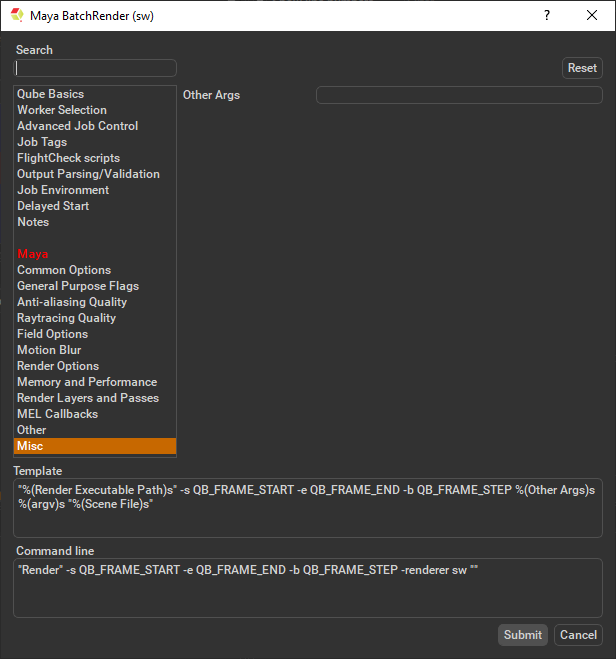

# Maya Batch Submission

## Step by step instructions for submitting Maya Batch jobs with Qube!

### Install the Qube! Submission UI into Maya

**(First Time Only)**

If you want the submission menu inside of Maya (recommended) then
install the InApp plugins via the QubeUI application as shown here. To
do this, launch the QubeUI:

- **Windows**: Double-click the color desktop icon

- **macOS**: Find the color icon in Applications/pfx/qubeui and
  double-click on it

- **Linux**: Type 'qubeui' at the command line (without the quotes)

Then navigate to the File menu, choose "Install App UI" and choose the
Maya option. This will install ALL Maya submission UIs. You will need to
do this on every workstation that you intend to submit Maya jobs from.

### Launch a Qube! submission UI

Once installed you should be able to locate the "Qube!" menu in
Maya's menu bar.

With a scene loaded in Maya choose "Submit Batch Render...", then the
matching submission for the renderer you are using.

Note that you could also choose "Submit Maya Render Job..." depending
on your requirements.

Render vs Batch Render

:::info

What's the difference?

**Submit Batch Render** will use the *command line* to open a new
instance of the Maya file for each frame that it renders. Although this
can be slower for large scenes, it can also be more flexible in large,
complex environments.

**Submit Maya Render Job** will open a copy (instance) of Maya on the
Worker that picks up the job, and that instance will render frames as
assigned by the Supervisor. Since the scene file is only being opened
one time, this can be faster to generate the full sequence.

:::

### Job Submission Details

Parameters Specific to Maya.

:::info

While not strictly required, the following settings are useful for
getting a better result.

-   Optimize the use of cores. Set the "Slots = Threads" checkbox and
    then set the "Specific Thread Count" to a value like 8 (assuming
    you have 8 cores).

-   Maya 2016.5 introduced a new render layer paradigm. To render scenes
    which may contain both the new and legacy render layers choose the
    'EMLRL' checkbox to set the 'Job Environment' variable
    'MAYA_ENABLE_LEGACY_RENDER_LAYERS'.

:::

:::info

Not all sections need to be filled in in order to render only the fields
marked in red are required

:::

**Render Executable Path**

Path to Maya Render executable on the workers.

**Scene File**

Path to Maya scene (required). Browse for or enter manually the location
of the scene file to be rendered. This is a required field for
submission.

Important: Best practice is to ensure the scene file and all of its
dependent files such as textures are on network storage accessible by
the workers.

In progress, check back soon

In progress, check back soon

In progress, check back soon

In progress, check back soon

In progress, check back soon

In progress, check back soon

In progress, check back soon

In progress, check back soon

In progress, check back soon

**preRenderMel**

The mel string to be executed before a scene is rendered. Enter the
script string.

**postRenderMel**

The mel string to be executed after a scene is rendered. Enter the
script string.

**preRenderLayerMel**

The mel string to be executed before a render layer is rendered. Enter
the script string.

**postRenderLayerMel**

The mel string to be executed after a render layer is rendered. Enter
the script string.

**preRenderFrameMel**

The mel string to be executed before a frame is rendered. Enter the
script string.

**postRenderFrameMel**

The mel string to be executed after a frame is rendered. Enter the
script string.

In progress, check back soon

In progress, check back soon

### Submit

Click 'Submit'

For further details on the submission UI see below.

