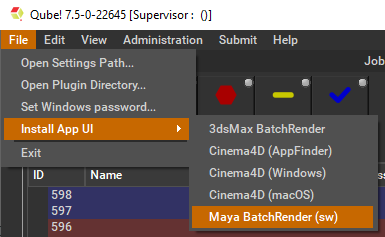
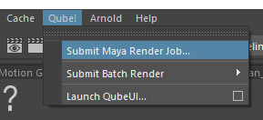
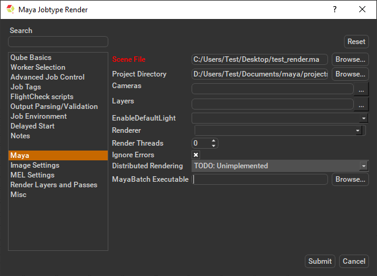
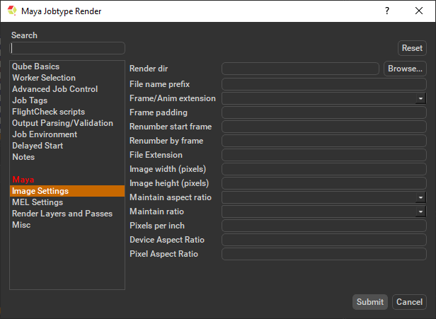
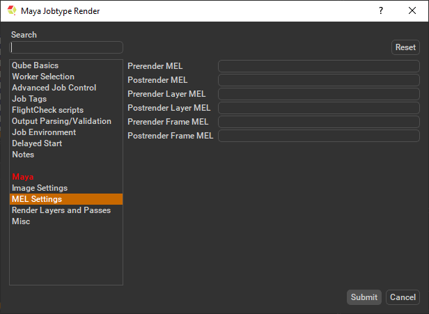
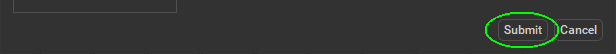

# Maya Job Submission

## Step by step instructions for submitting Maya LoadOnce jobs with Qube!

### Install the Qube! Submission UI into Maya

**(First Time Only)**

If you want the submission menu inside of Maya (recommended) then
install the InApp plugins via the QubeUI application as shown here. To
do this, launch the QubeUI:

-   **Windows**: Double-click the color desktop icon

-   **macOS**: Find the color icon in Applications/pfx/qubeui and
    double-click on it

-   **Linux**: Type 'qubeui' at the command line (without the quotes)

Then navigate to the File menu, choose "Install App UI" and choose the
Maya option. This will install ALL Maya submission UIs. You will need to
do this on every workstation that you intend to submit Maya jobs from.

### Launch a Qube! submission UI

Once installed you should be able to locate the "Qube!" menu in
Maya's menu bar.

With a scene loaded in Maya choose "Submit Maya Render Job...".

Note that you could also choose "Submit Batch Render..." depending on
your requirements.

Render vs Batch Render

:::info

What's the difference?

**Submit Maya Render Job** will open a copy (instance) of Maya on the
Worker that picks up the job, and that instance will render frames as
assigned by the Supervisor. Since the scene file is only being opened
one time, this can be faster to generate the full sequence.

**Submit Batch Render** will use the *command line* to open a new
instance of the Maya file for each frame that it renders. Although this
can be slower for large scenes, it can also be more flexible in large,
complex environments.

:::

### Job Submission Details

Parameters Specific to Maya.

:::info

While not strictly required, the following settings are useful for
getting a better result.

-   Optimize the use of cores. Set the "Slots = Threads" checkbox and
    then set the "Specific Thread Count" to a value like 8 (assuming
    you have 8 cores).

-   Maya 2016.5 introduced a new render layer paradigm. To render scenes
    which may contain both the new and legacy render layers choose the
    'Legacy Render Layers' checkbox to set the 'Job Environment'
    variable 'MAYA_ENABLE_LEGACY_RENDER_LAYERS'.

:::

:::info

Not all sections need to be filled in in order to render only the fields
marked in red are required

:::

**Scene File**

Path to Maya scene (required). Browse for or enter manually the location
of the scene file to be rendered. This is a required field for
submission.

Important: Best practice is to ensure the scene file and all of its
dependent files such as textures are on network storage accessible by
the workers.

**Project Directory**

Path to Maya project directory. If you are submitting from Maya, this
will be filled in for you. Otherwise, browse for or enter manually the
location of the project directory.

Important: Best practice is to ensure the project directory and all of
its dependent files such as textures are on network storage accessible
by the workers.

**Cameras**

List of cameras to use for render (space-separated). Choose from
pre-populated list and or enter manually cameras to override scene
settings.

**Layers**

List of layers to render (space-separated). Choose from pre populated
and or enter manually layers to override scene settings.

**EnableDefaultLight**

Choose from drop down to override scene settings.

**Renderer**

Choose from drop down to override scene settings 

**Render Threads**

Number of threads each subjob should use. This is set for you if you set
the Specific Thread Count above. Set to -1 to use the value of
host.processors instead, 0 to use all cores on the Worker (if the
renderer supports that).

**Ignore Errors**

Tick the box to ignore errors. This ignores error messages that are
generated during the render that would otherwise cause frames to fail.

**Distributed Rendering (Unimplimented)**

Enable Distributed Rendering (mental ray satellite OR V-Ray DR). Choose
from the drop down to override scene settings. See also

**Maya Batch Executable**

Browse for or specify the path to the maya executable file
(mayabatch.exe for Windows), if you want to override the auto-detected
default. In normal circumstances, this field should be left blank.

Important : Be aware that if you are submitting from one OS to another,
the path to the executable will be different. Qube! will handle that if
you leave this field blank.

**Render dir**

Path to Maya output render directory. Browse to or manually enter the
location of the output image file you wish to generate. You should never
have to set this manually.

Important: Best practice is to ensure outputs are written to network
storage accessible by the workers.

**File name prefix**

Image file name prefix overrides the Maya scene settings, eg in
name.#.ext, **name** would be changed.

**Frame/Anim extension**

Choose from drop down to override the Maya scene settings, and position
the frame numbers in the output file name.

**Frame padding**

Number of digits for frame number, e.g. using 4 would produce
name.0001.ext.

**Renumber start frame**

The starting output image filename extension value. Enter the numeric
value to override the Maya scene settings.

**Renumber by frame**

The output image filename extension step ('by' or increment) value.
Enter the numeric value to override the Maya scene settings.

**File Extension**

The string added at the end of the file name. Enter the file extension
value to override scene settings.

**Image width (pixels)**

Image width. Enter the numeric value to override scene settings

**Image height (pixels)**

Image height. Enter the numeric value to override scene settings

**Maintain aspect ratio**

Maintain Aspect ratio. Select required option from drop down

**Maintain ratio**

Maintain ratio. Select required option from drop down

**Pixels per inch**

Resolution (Pixels/Inch). Enter the numeric value to override scene
settings

**Device Aspect Ratio**

Device Aspect Ratio. Enter the numeric value to override scene settings

**Pixel Aspect Ratio**

Pixel Aspect Ratio. Enter the numeric value to override scene settings

**preRenderMel**

The mel string to be executed before a scene is rendered. Enter the
script string.

**postRenderMel**

The mel string to be executed after a scene is rendered. Enter the
script string.

**preRenderLayerMel**

The mel string to be executed before a render layer is rendered. Enter
the script string.

**postRenderLayerMel**

The mel string to be executed after a render layer is rendered. Enter
the script string.

**preRenderFrameMel**

The mel string to be executed before a frame is rendered. Enter the
script string.

**postRenderFrameMel**

The mel string to be executed after a frame is rendered. Enter the
script string.

### Submit

Click 'Submit'

For further details on the submission UI see below.

